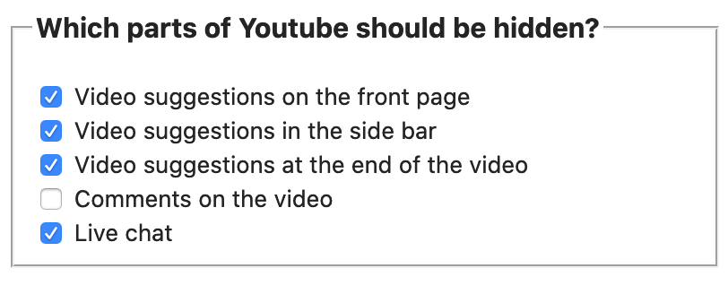

# Youtube Blinders

Download it here: https://addons.mozilla.org/firefox/addon/youtube-blinders/

## What it does

This extension allows you to hide the following from Youtube:

- The videos on the front page
- The video suggestions in the side bar (when you are watchin a video)
- The video suggestions after you are done watching a video
- Comments under the videos

## How to change the settings

All 4 of the options mentioned in the intro can be turned on or off. Here's how:

- Go to `about:addons` in your URL bar
- Find Youtube Blinders in your extensions and click on `Preferences`
- At the bottom of that page you'll find the options as a list of checkboxes

The settings should look something like this:

